# Electron renderer UI/UX audit

Date: 2026-08-12

Scope: Ronin's React renderer as embedded by Electron, including empty/project onboarding, new-thread composition, settings, remote-environment setup, the command palette, right-panel surfaces, files, sidebar states, keyboard behavior, and desktop preview shortcut plumbing. The audit used an isolated T3 home and did not modify product code.

## Verdict

The product is visually coherent and unusually disciplined for a dense developer tool. The main chat shell, command palette, theme library, right-panel surface picker, focus restoration, and disabled-state explanations are strong. The largest risks are not general polish: they are a retry storm in an error path, a missing accessible name on the primary composer, several broken or misleading keybinding states, incomplete shortcut forwarding from the Electron preview guest, and inaccessible remote-environment validation.

## Prioritized findings

### P1 — Fix before the next desktop release

1. **A failed thread snapshot can enter a persistent ~250 ms retry loop.** A deliberately invalid snapshot produced an HTTP 500 roughly 3.7 times per second, thousands of browser/server log entries, and about 70 MB of rotated trace logs in a few minutes. Leaving the thread did not stop it. The HTTP loader converts failure to `None`, then the WebSocket subscription retries after 250 ms and performs the HTTP load again. Evidence: `packages/client-runtime/src/state/threadSnapshotHttp.ts:99`, `packages/client-runtime/src/state/threads.ts:593`, and `packages/client-runtime/src/state/threads.ts:639`. Add bounded exponential backoff, avoid repeating HTTP bootstrap on every socket retry, and expose a recoverable error state instead of an endless loading state.

2. **The main message composer has no accessible name.** The browser accessibility tree reports `textbox ""` on both new and existing threads. The contenteditable only receives `aria-placeholder`, not `aria-label` or `aria-labelledby` (`apps/web/src/components/ComposerPromptEditor.tsx:1753`). This makes the product's primary input ambiguous to screen-reader and voice-control users.

3. **The Keybindings page is broken in four user-visible ways.** See Steps 6, 13, and 14.
   - The shipped Model Picker 1–9 bindings warn against the shipped Thread Jump 1–9 bindings on both sides, so a clean default install presents 18 conflict warnings. The detector treats any unconditional binding as overlapping (`apps/web/src/components/settings/KeybindingsSettings.logic.ts:134`), even though the model-picker shadowing is intentional.
   - Searching the exact visible label `Preview: Zoom In` returns no result because filtering checks the command slug, key, condition, and source—but not `commandLabel(row.command)` (`apps/web/src/components/settings/KeybindingsSettings.logic.ts:199`).
   - `mod++` is split into `mod`, empty, empty; the `+` key renders as two blank keycaps and React reports duplicate empty keys (`apps/web/src/components/settings/KeybindingsSettings.tsx:77`).
   - At Electron's supported minimum width of 840 px, the table's 680 px minimum width pushes the Status column off-screen while `hideScrollbars` removes the visual affordance (`apps/web/src/components/settings/KeybindingsSettings.tsx:1293`; Electron minimum at `apps/desktop/src/window/DesktopWindow.ts:301`).

4. **Several advertised preview shortcuts are not forwarded when the embedded page owns focus.** The default map advertises focus URL and zoom controls (`packages/shared/src/keybindings.ts:31`), but the Electron guest only handles refresh and forwards J/K/,/W (`apps/desktop/src/preview/Manager.ts:239`, `apps/desktop/src/preview/Manager.ts:1162`). This means Cmd/Ctrl+L, +, -, and 0 can be consumed by the guest or application menu instead of operating the preview in the most likely focus state. This is code-confirmed routing coverage, but native accelerator precedence still needs an Electron smoke test.

### P2 — Important usability and accessibility fixes

5. **A brand-new thread says “Ask for follow-up changes or attach images.”** Step 3 shows follow-up language before any conversation exists. The branch is keyed to `phase === "disconnected"` rather than new-thread intent (`apps/web/src/components/chat/ChatComposer.tsx:3101`). It also hides the useful `@tag`, `$skills`, and `/commands` guidance at the moment onboarding needs it most.

6. **Remote-environment validation is not associated with the fields.** Empty submit remains enabled; the error is a plain `
` with no `role="alert"`, `aria-live`, `aria-invalid`, or `aria-describedby`, and focus stays on the submit button (`apps/web/src/components/settings/ConnectionsSettings.tsx:2171`). The same failure is also duplicated in a toast, which is noisy visually without fixing field-level accessibility.

7. **Connection copy switches nouns mid-task.** The same modal uses “Add Environment,” “client,” “Remote link,” “backend host,” “Could not add backend,” and “Backend added” (`apps/web/src/components/settings/ConnectionsSettings.tsx:1939`, `apps/web/src/components/settings/ConnectionsSettings.tsx:2733`). Use the product glossary's environment/client terms consistently; reserve backend/server for technical diagnostics.

### P3 — Polish

8. **Wide General settings rows have weak label/control association.** At 1440 px, descriptions sit near the left edge while toggles and selects sit at the far right of the 4xl container. The layout is clean but requires long eye travel (Step 4). Tighten the row grid or cap the ordinary settings-row measure while leaving rich panels wider.

## Flow coverage

1. **Empty state — Healthy.** Clear hierarchy, a single obvious outcome, and a strong central CTA. The duplicate sidebar/center Add project entry is acceptable discoverability rather than clutter.

   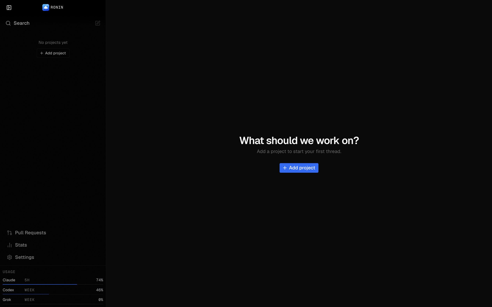

2. **Add-project sources — Mostly healthy.** Local, Git URL, and GitHub paths are easy to compare; setup-required states are explicit. Search relies on placeholder text as its visible label.

   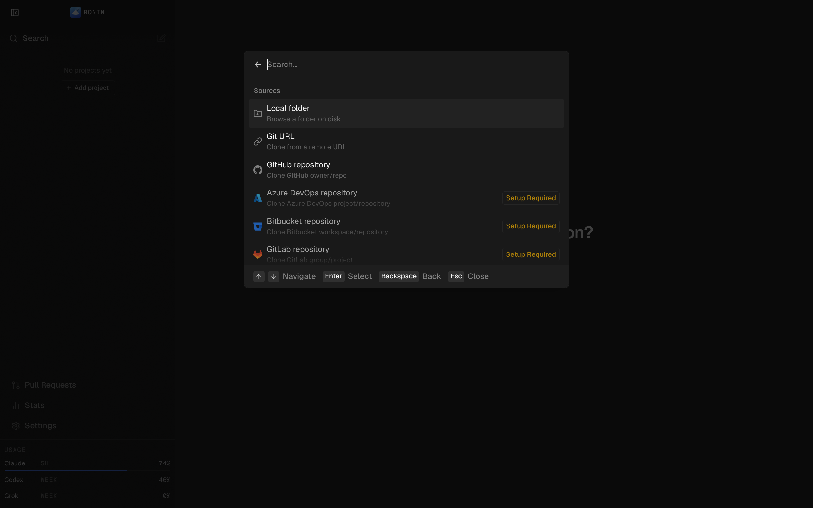

3. **New-thread composer — Needs attention.** Strong visual focus and compact provider/workspace controls, but the placeholder is contextually wrong and the composer has no accessible name.

   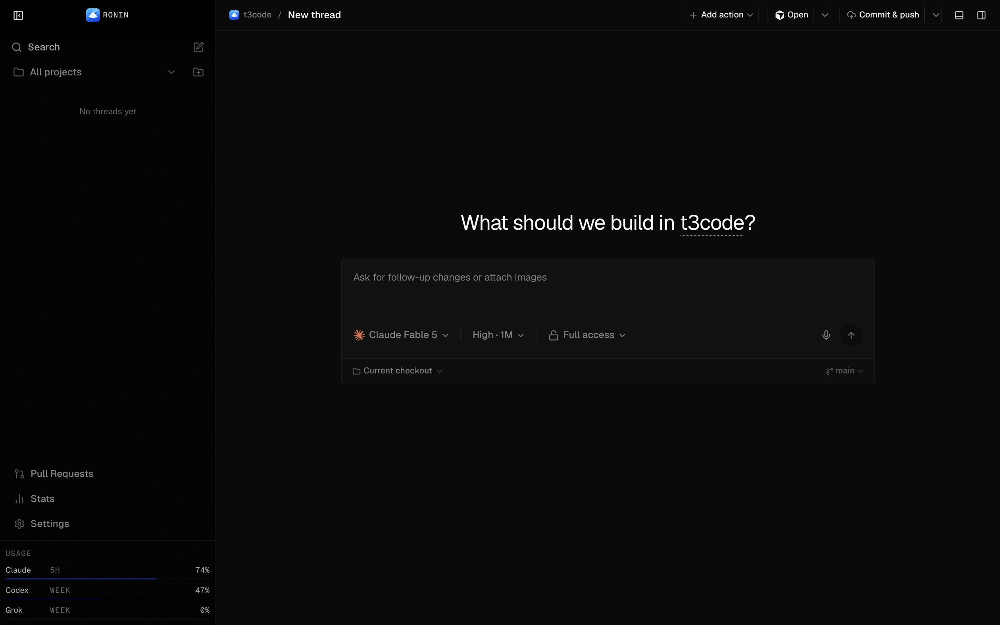

4. **General settings — Mostly healthy.** Grouping and descriptions are clear; wide label/control separation weakens scanability.

   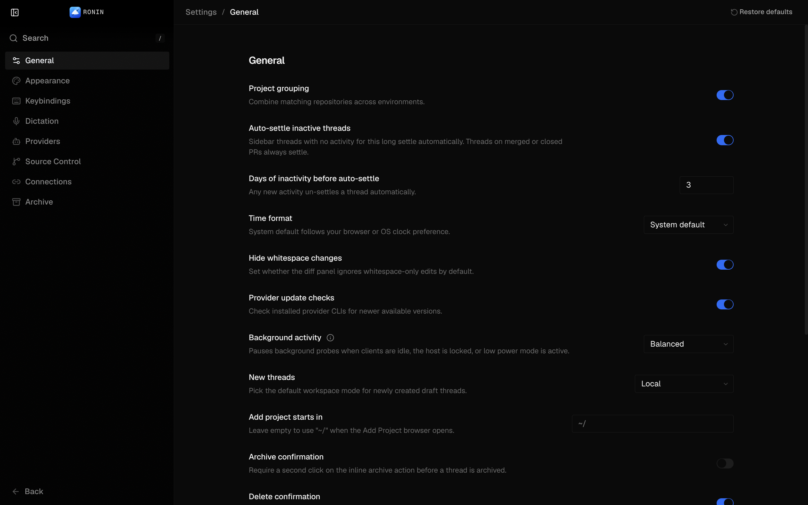

5. **Appearance settings — Healthy.** The mode cards, theme pairing, selected states, and visual previews are consistent. Visible text passed the sampled contrast check in this state.

   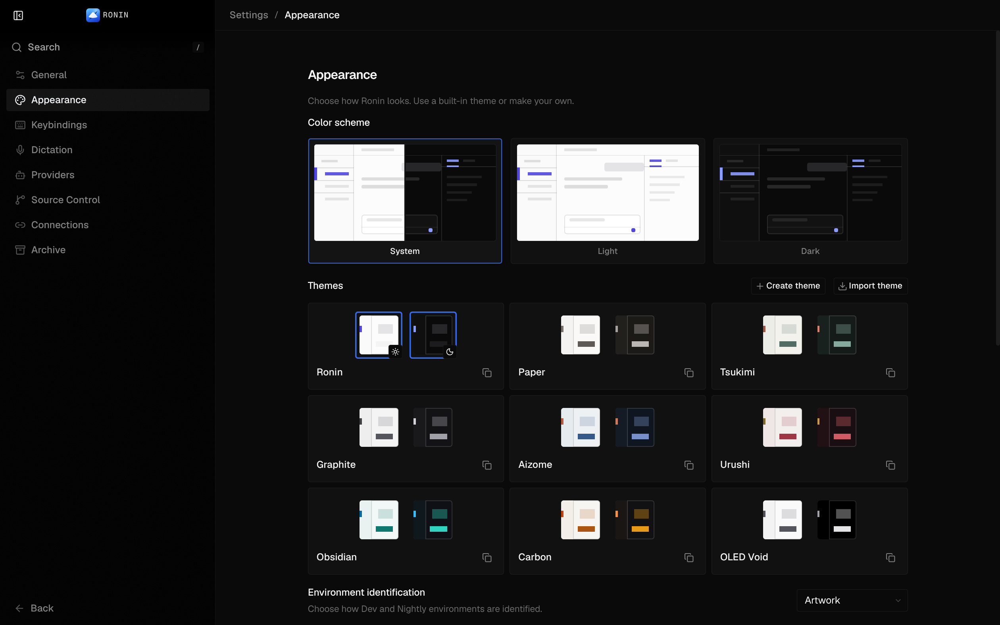

6. **Keybindings overview — Needs work.** The clean default configuration displays repeated conflict warnings, making the settings page look pre-broken.

   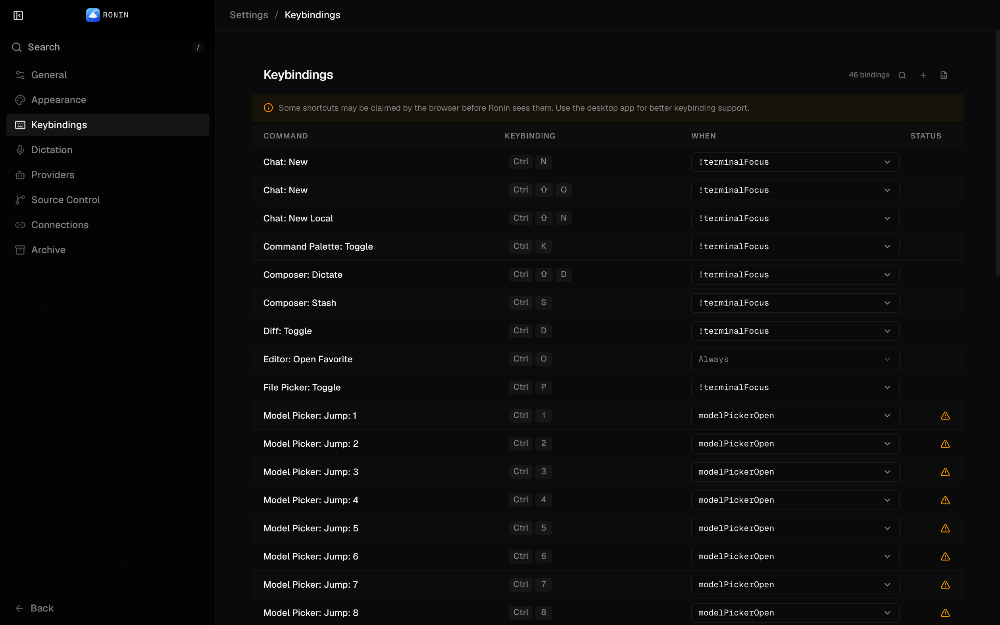

7. **Add remote environment — Needs attention.** The mode cards and field grouping are understandable, but terminology changes within the modal.

   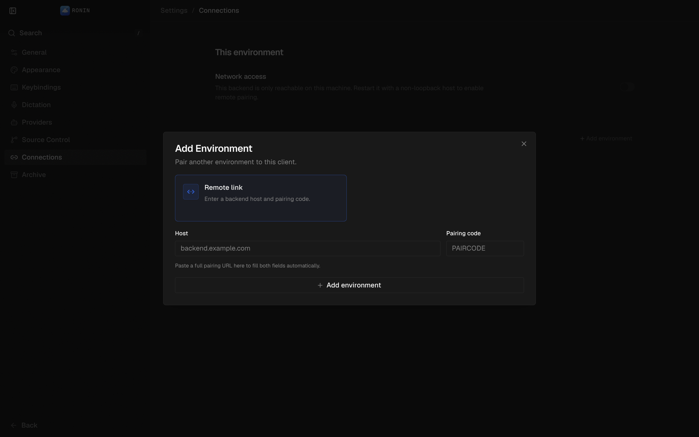

8. **Remote validation error — Needs work.** The error is visible but not programmatically tied to the Host field, focus is not moved, and feedback is duplicated in a toast.

   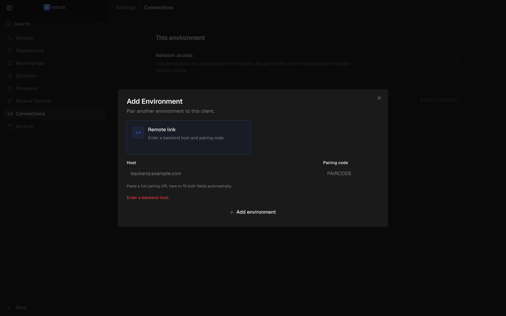

9. **Command palette — Healthy.** Commands, categories, and shortcuts scan well. Escape restored focus to the composer in the tested path.

   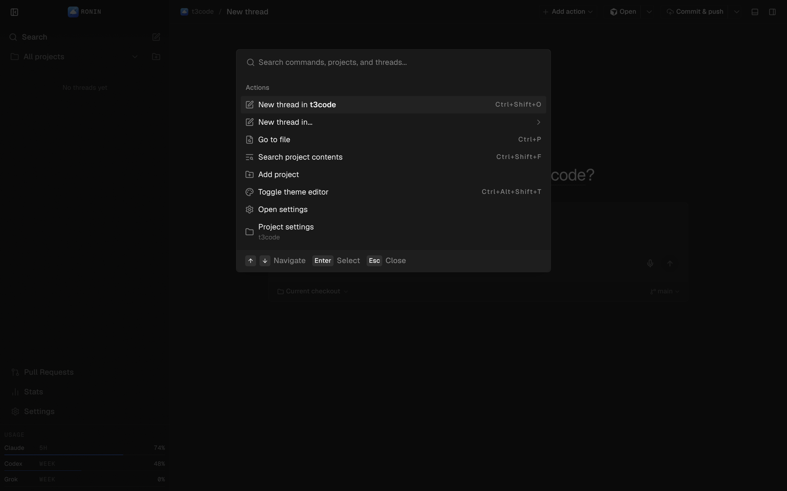

10. **Right-panel surface picker — Healthy.** Available and unavailable surfaces are clearly separated, with reasons for disabled choices. Header/composer controls collapse sensibly when space narrows.

    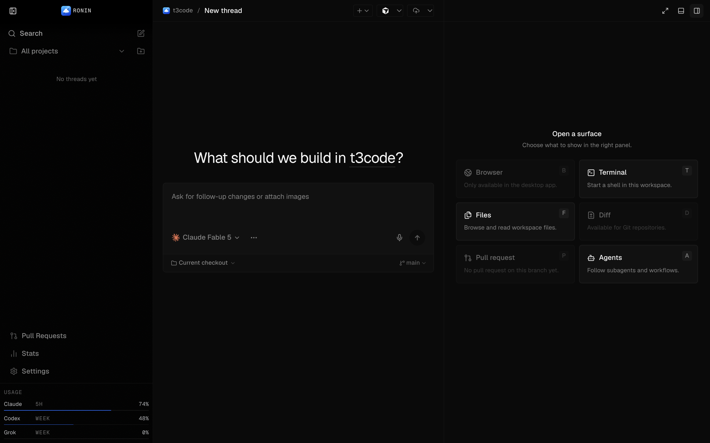

11. **Files panel — Healthy.** Dense but readable; the tree and selected row remain legible without overwhelming the composer.

    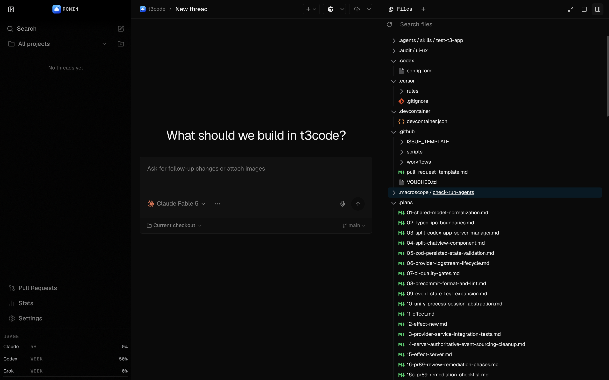

12. **Populated sidebar states — Mostly healthy.** Approval/Input badges and settled grouping are visible; long titles truncate cleanly. Live-state animation and timestamp/status density deserve a future performance pass with many active threads.

    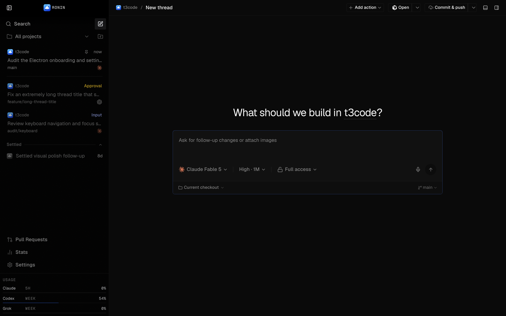

13. **Keybinding label search — Broken.** Entering an exact label already visible in the table returns “No keybindings match your search.”

    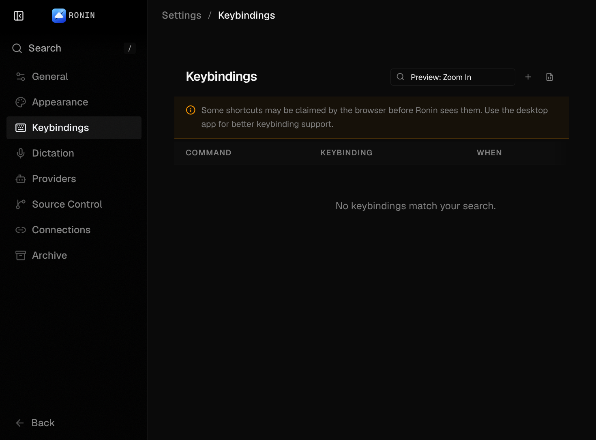

14. **Plus-key binding at minimum window size — Broken.** The `+` shortcut shows two empty keycaps; the Status column is also outside the visible table at the supported minimum width.

    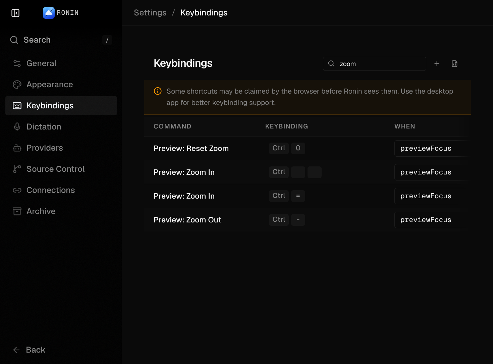

## Accessibility risks

- Primary composer: verified blank accessible name.
- Remote validation: verified missing field association and alert semantics in source.
- Minimum-width keybindings: verified off-screen Status content with hidden scrollbar.
- Keyboard conflict warnings are focusable and named, which is good, but their out-of-box volume creates noise.
- A full screen-reader pass, forced-colors mode, 200% zoom/reflow test, native menu narration, and automated axe scan were not performed; this report does not claim WCAG compliance.

## Evidence limits

- Screenshots were captured from the live React renderer in an isolated T3 environment at 1440×900, plus the Keybindings failures at Electron's 840×620 minimum.
- The Electron native window chrome, application menu behavior, OS-specific accelerators, Browser preview guest, and native context menus were source-audited but not exercised through Computer Use. The preview-shortcut finding therefore needs one native smoke pass before implementation.
- The Browser preview surface is desktop-only and unavailable in the web renderer; Terminal content is canvas-backed and was not used for accessibility claims.
- Seeded sidebar data was isolated and removed after it exposed the retry-loop failure; the disposable server remains available for follow-up renderer checks.
