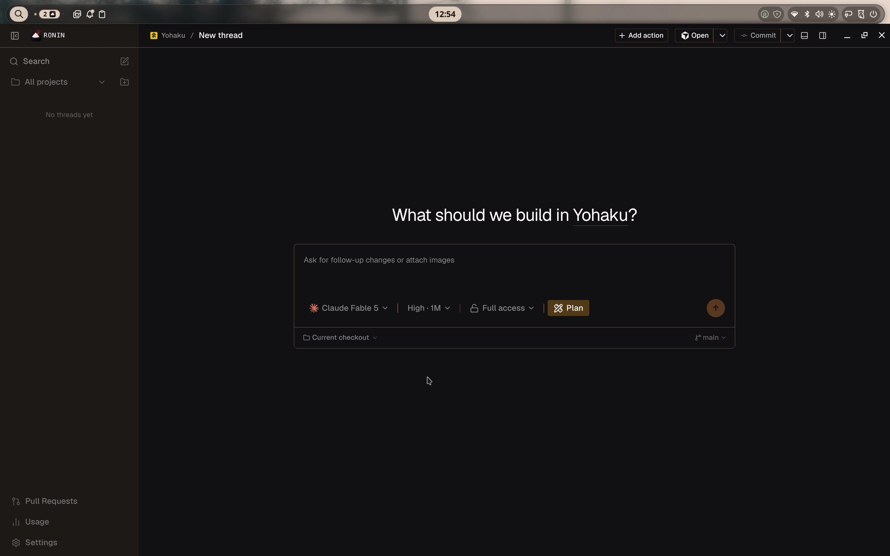
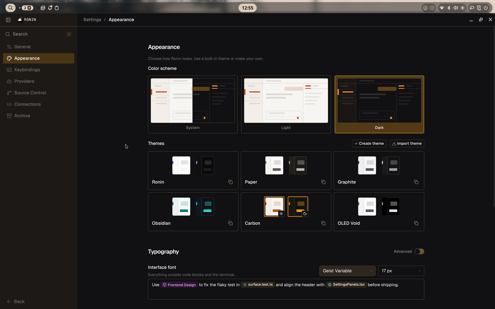
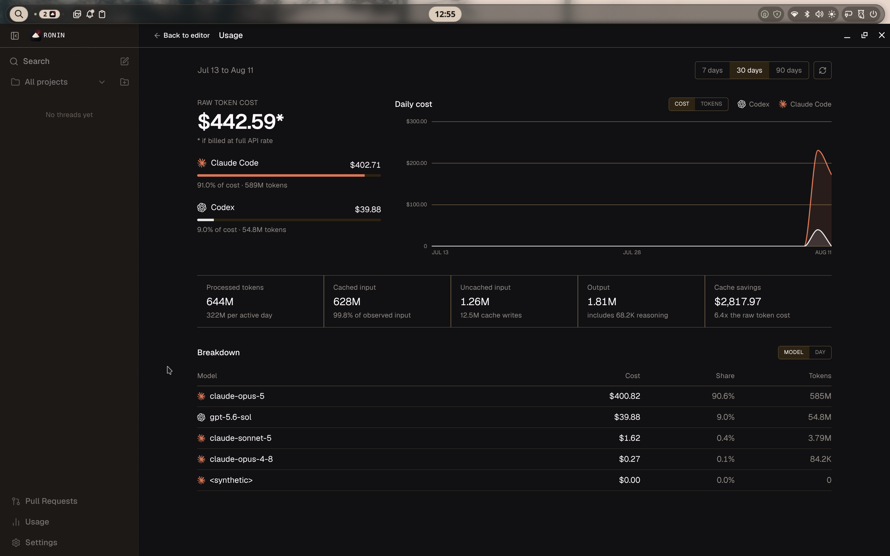

<p align="center">
  
</p>

<h1 align="center">Ronin</h1>

<p align="center">
  <strong>浪人</strong> · a masterless samurai<br/>
  <em>Your agents. Your machine. No master but you.</em>
</p>

<p align="center">
  <a href="#gallery">Gallery</a> ·
  <a href="#how-ronin-differs-from-t3-code">Why Ronin</a> ·
  <a href="#run-it">Run it</a> ·
  <a href="#documentation">Docs</a>
</p>

---

Ronin is a **lean desktop harness** for coding agents — rebuilt UI, thinner surface, same sharp forge.

Drive the CLIs you already pay for (Codex, Claude Code, Cursor, Grok Build, OpenCode) from a dark-first Electron shell: chat, terminal, preview, **git**, usage, and settings. Bring your own subscription. Nothing is sold here.

This tree is a **fork of [T3 Code](https://github.com/pingdotgg/t3code)** — event-sourced server, multi-provider adapters, remote-ready websockets — re-cut and re-skinned for a masterless desktop.

---

## Gallery

<p align="center">
  
</p>
<p align="center"><sub><strong>Workspace</strong> — centered composer, resizable sidebar, project-aware threads, source control in the title bar.</sub></p>

<br/>

<p align="center">
  
</p>
<p align="center"><sub><strong>Appearance</strong> — system / light / dark, first-party themes (Ronin, Carbon, OLED Void…), typography you can tune.</sub></p>

<br/>

<p align="center">
  
</p>
<p align="center"><sub><strong>Usage</strong> — spend and tokens by provider and model, with a one-click path back to the editor.</sub></p>

---

## How Ronin differs from T3 Code

T3 Code is an excellent open product with a wide surface. Ronin is that product after a deliberate **cut** — and a **full UI pass**.

|                      | **T3 Code**                                            | **Ronin**                                                                        |
| -------------------- | ------------------------------------------------------ | -------------------------------------------------------------------------------- |
| **UI**               | Classic T3 shell                                       | **New workspace chrome** — slim sidebar, hairline topbar, calmer density         |
| **Identity**         | Broad agent control surface                            | Desktop-first fork with a sharper edge                                           |
| **Product surface**  | Desktop + local web + cloud/Connect + mobile/marketing | Desktop + local server/renderer only                                             |
| **Windows / WSL**    | Dual backend, WSL distro orchestration                 | Native backends only — **no WSL**                                                |
| **Preview**          | Element pick, PiP, Playwright automation               | Tabs, navigate, screenshot, recording                                            |
| **Sidebar**          | Legacy tree toggle + modern cards                      | **One modern sidebar** — no legacy tree                                          |
| **Assistant output** | Optional token-by-token streaming                      | **Buffered only** — cleaner read path                                            |
| **Themes**           | Managed palettes                                       | Managed + **deep OLED** (Void, Azure, Phosphor, Plasma…) + **Ronin** brand theme |
| **Git**              | Full source control                                    | **Kept** — checkpoints, diffs, branches, PR flows                                |
| **Packaging**        | Multi-platform + WSL prebuilds                         | **Linux-first**, Mac supported; artifacts named **Ronin**                        |
| **Philosophy**       | Feature-rich open default                              | _Measure twice, cut once_                                                        |

### UI that changed

- **Workspace shell** — resizable left rail, floating collapse control, single topbar strip for chat / settings / usage
- **Composer-first empty state** — “What should we build in …?” with provider, effort, and plan controls in one card
- **Git in the chrome** — Open / Commit (and related actions) live in the workspace topbar, not buried
- **Settings as a place** — Appearance, providers, source control, connections in a dedicated nav (not a grab bag)
- **Usage as a first-class page** — charts, model breakdown, **Back to editor**

### What we cut

- **T3 Connect / hosted relay** — no cloud pairing product, no Clerk-shaped hosted path
- **Mobile app & marketing site** — not in this repo
- **WSL as a second OS** — no `wsl.exe` orchestrator, distro picker, or dual Windows+Linux backend
- **Playwright preview fat** — no element pick, no PiP window, no injected automation runtime
- **Legacy sidebar** — original per-project tree UI and its settings toggle
- **Legacy token streaming** — token-by-token paint path removed; assistants buffer cleanly
- **Packaging ballast** — WSL node-pty prebuild job, dual-OS Windows stage deps for WSL

### What we keep (on purpose)

- **Git features** — checkpoints, restore, diffs, worktrees, source control UI, PRs
- **Multi-provider agents** — Codex · Claude · Cursor · Grok · OpenCode
- **Remote-ready architecture** — local, LAN, Tailscale / SSH
- **Performance posture** — no continuous GPU-burning chrome; careful websocket + render cost
- **Open source** — forkable, inspectable, yours

> Ronin is not “T3 Code but worse.” It is **T3 Code with the masterless cut**: fewer doors, same forge, new face.

---

## What you get

```
┌─────────────────────────────────────────────────────────┐
│  Ronin (Electron)                                       │
│  ┌──────────┐  ┌────────────────────────────────────┐   │
│  │ Sidebar  │  │ Workspace topbar · git · panels    │   │
│  │ Threads  │  │ Chat · composer · terminal         │   │
│  │ PRs ·    │  │ Usage · Settings · OLED themes     │   │
│  │ Usage    │  └──────────────────▲─────────────────┘   │
│  └────┬─────┘                     │                     │
│       │ typed WS / IPC            │                     │
│  ┌────▼───────────────────────────┴─────────────────┐   │
│  │  Server · event-sourced · provider adapters      │   │
│  │  checkpoints · reactors · receipts               │   │
│  └──────────────────────────────────────────────────┘   │
└─────────────────────────────────────────────────────────┘
```

- **Desktop app** — primary surface (Electron embeds the web renderer)
- **Local server** — Node backend on your machine
- **Your providers** — if the CLI works in a terminal, Ronin can drive it
- **Source control** — first-class git, not an afterthought

---

## Run it

> [!IMPORTANT]
> Install and authenticate at least one provider first:
>
> | Provider   | Install                                               | Auth                  |
> | ---------- | ----------------------------------------------------- | --------------------- |
> | Codex      | [Codex CLI](https://developers.openai.com/codex/cli)  | `codex login`         |
> | Claude     | [Claude Code](https://claude.com/product/claude-code) | `claude auth login`   |
> | Cursor     | [Cursor CLI](https://cursor.com/cli)                  | `agent login`         |
> | Grok Build | [Grok Build CLI](https://x.ai/cli)                    | `grok login`          |
> | OpenCode   | [OpenCode](https://opencode.ai)                       | `opencode auth login` |

### From this fork

```bash
# Node 22.16+ / 23.11+ / 24.10+
curl -fsSL https://vite.plus | bash   # install vp (macOS/Linux)

vp i
vp run dev            # server + web
# or
vp run dev:desktop    # Electron shell
```

Ports are worktree-stable; read the `[dev-runner]` line for the real URL. Pairing needs the **full URL including the token**.

### Desktop artifact

```bash
vp run build:desktop
vp run dist:desktop:linux          # primary path
vp run dist:desktop:dmg:arm64      # macOS
```

Artifacts ship as `Ronin-${version}-${arch}.${ext}`.

---

## Themes

Dark-first by default. Built-ins include **Ronin**, Paper, Graphite, Obsidian, Carbon, and pure-black **OLED Void** (plus Azure / Phosphor / Plasma siblings). Import or create your own. On Wayland+Vulkan, desktop softens glass so backdrop blur does not fall over.

<p align="center">
  
</p>

---

## Documentation

| Audience           | Start here                                                   |
| ------------------ | ------------------------------------------------------------ |
| Using Ronin        | [docs/user/install.md](./docs/user/install.md)               |
| Keybindings        | [docs/user/keybindings.md](./docs/user/keybindings.md)       |
| Source control     | [docs/user/source-control.md](./docs/user/source-control.md) |
| Remote / Tailscale | [docs/user/remote-access.md](./docs/user/remote-access.md)   |
| Architecture       | [docs/internals/overview.md](./docs/internals/overview.md)   |
| Glossary           | [docs/internals/glossary.md](./docs/internals/glossary.md)   |

Full tree: [docs/](./docs).

---

## Status

Early. Expect bugs. Prefer small fixes over grand PRs unless we ask.

Read [CONTRIBUTING.md](./CONTRIBUTING.md) before opening an issue or PR.

---

## Lineage

Ronin stands on **[T3 Code](https://github.com/pingdotgg/t3code)** by Theo and the T3 tools team.

```
upstream  →  pingdotgg/t3code
this fork →  0veek/t3code  (Ronin)
```

Screenshots live in [`Screenshots/`](./Screenshots) (`Code.png`, `Themes.png`, `Usage.png`).

---

<p align="center">
  <sub>浪人 — cut free. Keep the blade sharp.</sub>
</p>
